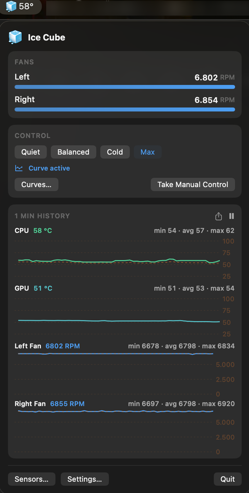
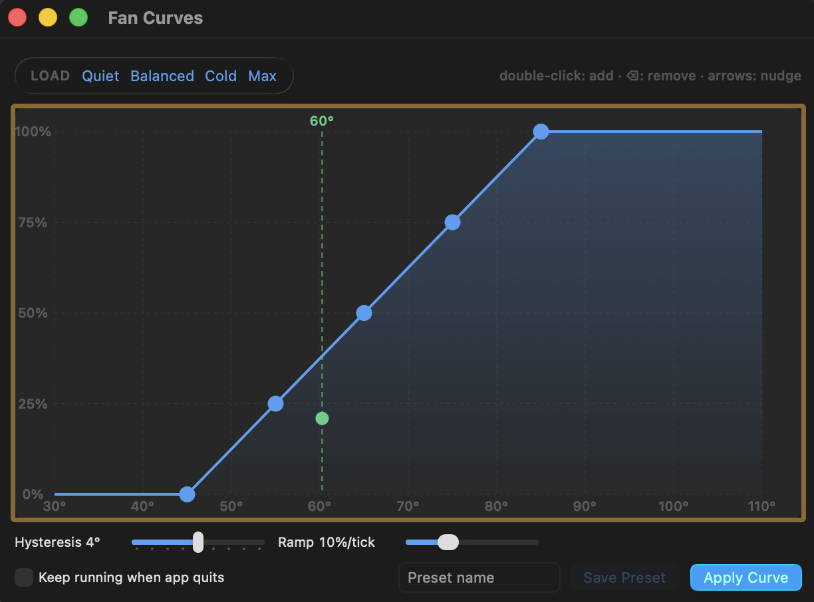
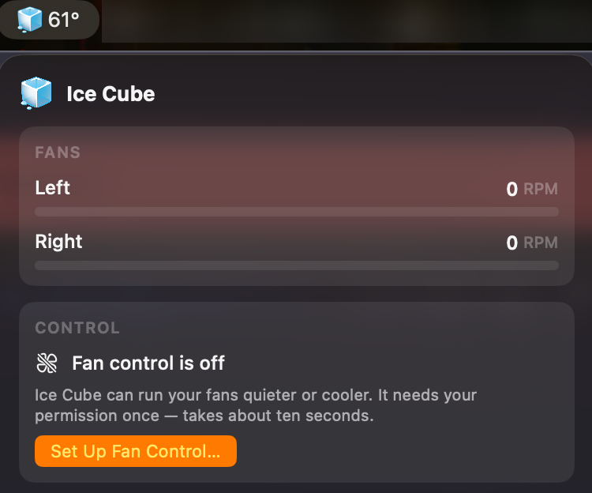
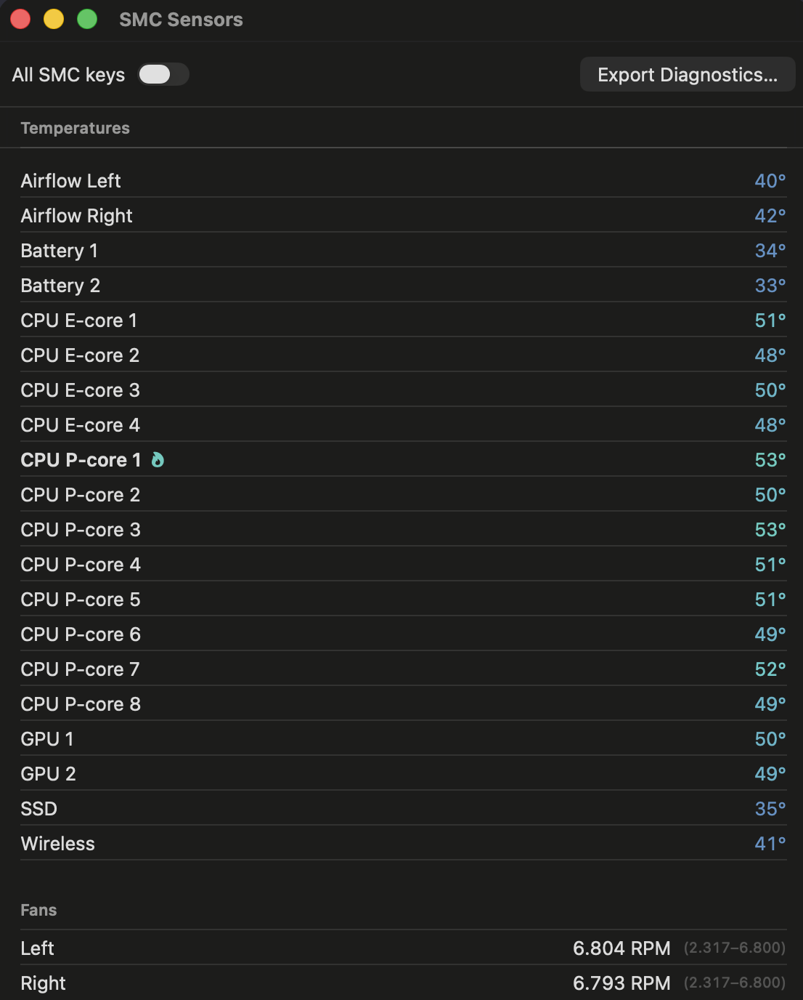

# Ice Cube

[](https://github.com/thijsvos/icecube/actions/workflows/ci.yml)
[](LICENSE)


An open-source menu-bar fan controller and thermal monitor for **Apple Silicon
MacBooks**. Live stacked temperature/RPM charts, a draggable fan-curve editor,
one-click presets — built on a hardened privilege split: the app only ever
*reads* sensors, while a tiny root helper daemon owns every fan write and
enforces safety limits the UI cannot override. **Zero third-party
dependencies**; small footprint is a design goal, not an accident.

<p align="center">
  
</p>

> **Status: beta.** Fully functional — monitoring, manual control, curves,
> presets, boot persistence. The [download](#install) is a complete hardware
> monitor; fan control needs a one-minute local build (a free Apple ID is
> enough) because macOS will not let an unsigned app register a root helper.
> Verified on one Mac so far — see [Compatibility](#compatibility).
> Developed and tested on a MacBook Pro 14" M2 Pro
> (Mac14,9) under macOS 26. Other Apple Silicon Macs should work for
> monitoring out of the box; fan-control write paths for M3/M4 (`Ftst`
> unlock) and M5 are implemented from community research but unverified —
> reports welcome (see below).

## Features

| Feature | |
| --- | --- |
| Menu-bar popover with live stacked charts (CPU, GPU, per-fan RPM) | ✅ |
| 1/5/15/60-min windows, pause, hover crosshair, min/avg/max | ✅ |
| Fan-curve editor: drag points, double-click add, keyboard nudge, live marker | ✅ |
| Presets: Quiet · Balanced · Cold · Max, plus your own saved curves — selectable everywhere a built-in is, and deletable | ✅ |
| Manual per-fan sliders (watchdogged, never persisted) | ✅ |
| Switch presets automatically when you plug in or unplug | ✅ |
| **Away preset** *(opt-in)* — run a cooler preset while the screen is locked or the display asleep, and get yours back the moment you return | ✅ |
| ⌥-click the menu bar icon to jump to the next preset | ✅ |
| Curve keeps running at boot, app closed — daemon-side, opt-in | ✅ |
| Sensors browser (every SMC key, live) + JSON diagnostics export | ✅ |
| Power draw, and a cooling-efficiency index in °C/W — *is it hot, or is cooling failing?* | ✅ |
| Cooling history: whether this Mac sheds heat as well as it did in June — persisted, per fan-speed band, with a verdict that refuses when the data cannot carry it | ✅ |
| **"Why is it hot?"** — per-process watts, which silicon leads, and whether your curve has anything left | ✅ |
| **Forecast** *(opt-in)* — where this load settles, roughly when, and what a different fan speed would buy, from your own Mac's measured cooling | ✅ |
| Decision timeline: the charts mark *why* the fans moved, in the daemon's words | ✅ |
| **Made to measure** *(opt-in)* — draws what your Mac has actually measured behind the curve editor, and fits a curve to it: the quietest fan speeds that hold the temperature you pick, or the honest news that nothing on this Mac holds it | 🧪 experimental |
| CSV history export, temperature alerts, launch at login, °C/°F | ✅ |
| Update check via GitHub Releases — once a day, link only, never auto-install, switchable off | ✅ |
| **Inside** — a live drawing of the cooling path: silicon at its own temperature, blowers turning at their real speed, air moving at fan speed | 🧪 experimental |

**Inside is off until you turn it on**, in Settings → General → Experimental.
It replaces nothing: the popover and its charts are unchanged, and while the
switch is off there is no way to reach the window at all. It reads the same
once-a-second snapshot everything else does — no extra permission, nothing
written to disk, and no ability to touch the fans. It is the one part of the app
that redraws continuously while open, which is the reason it is opt-in.

It draws a *schematic*, not a floorplan: Ice Cube knows what each sensor
measures, not where it physically sits. And whether cooling is getting **worse**
is a question for Cooling History, which has the watts and a baseline behind it —
Inside shows you the machine right now and links there.

<p align="center">
  
  <br><em>The curve editor — drag points, double-click to add, arrow keys to nudge.</em>
</p>

## Compatibility

**One Mac has actually been verified.** Everything else is either implemented
from community research or falls back to generic probing, and this table says
which is which rather than implying broader support than exists.

| Mac | Monitoring | Fan control | Status |
| --- | --- | --- | --- |
| **MacBook Pro 14" M2 Pro** (`Mac14,9`) | curated sensor labels | works — `direct` path, `Md` key | **Verified** on macOS 26.4.1. The machine Ice Cube is developed on. |
| Other **M2** family (11 mapped `Mac14,x` ids) | curated sensor labels | expected — same `direct` path | Not yet reported |
| **M1** family | generic probe | implemented — `direct` path | Not yet reported |
| **M3 / M4** | generic probe | implemented — `Ftst` unlock, **from research only** | Not yet reported |
| **M5** | generic probe | implemented — `md` key rename, **from research only** | Not yet reported |
| **MacBook Air** (any, fanless) | works | no fans to control | Supported by design |
| **Intel** | not supported | not supported | Out of scope for v1 |

**Monitoring is the safe bet everywhere.** Unmapped models fall back to probing
every plausible `T***` sensor key, so temperatures and fan readings generally
work out of the box — you may just see rawer labels than the curated M2 set,
and a good many more of them.

**Expect the sensor list to fill in rather than arrive complete.** Apple Silicon
powers idle CPU clusters down, and a gated cluster's sensors return a frozen
placeholder instead of a temperature — for up to ~85 s at a stretch on the Mac
this was measured on. On a Mac with a curated map, which sensors you *have* is
decided from whether the firmware knows the key rather than from a first
reading, so the list is identical on every launch and never reorders: a sensor
with nothing real to say yet simply has no row until it reports one. A list that
reads 12 rows just after launch and 20 a minute later is that, and is expected.
(On an unmapped model the fallback probe still judges by value, so there the
count can differ between launches.)

**Fan control is the part that varies by generation.** The write sequence differs
across SoCs: M3/M4 need an `Ftst` unlock to make `thermalmonitord` yield, and M5
renamed the fan-mode key. Both are implemented from
[community research](docs/CREDITS.md) and **have never run on the hardware they
describe** — that is exactly what the table's "from research only" means.

### Fill in a row

Ice Cube can now answer this about your Mac itself:

**Settings → Fan Control → Check Fan Control.**

It forces the fan mode, writes each fan's *current* target back to itself, checks
the firmware kept it, and reverts — a real exercise of the write path that
commands no change in speed. On a Mac that takes the direct path (M1/M2) it is over
in milliseconds; a Mac that needs the `Ftst` unlock takes a few seconds. If macOS
has parked a fan at 0 RPM, the check commands that fan's minimum, so it can spin
briefly.

If it reports anything other than "works", that is worth sending: export
diagnostics from the **Sensors** window and open a
[New Mac model report](https://github.com/thijsvos/icecube/issues/new?template=new_mac_model.md).
The JSON includes the verdict, which unlock path your firmware needed, and which
mode key your generation uses — the three facts a row in this table is made of.
It also carries the fan controller's recent decisions, so a report about
surprising fan behaviour arrives with the reasoning already attached.

### Quiet on battery, cool on the desk

A laptop wants opposite things in the two situations: unplugged it is on your
lap, probably at night, and quieter is worth a warmer machine; on a desk cool
costs nothing. Settings → Fan Control can map a preset to each — *on battery use
Quiet, plugged in use Cold* — and switch as you plug and unplug.

It fires when the power source changes, and once when Ice Cube starts — never continuously. It is **off until you turn it on** in Settings. Pick a
different preset any time and it stays until you next plug in or unplug; the
rule responds to a change rather than policing a state, so it cannot end up
fighting you. Off until you turn it on, and both sides are your own choices.

Being app-side, it does not fire while a persisted curve runs with Ice Cube
closed — that curve keeps running exactly as configured.

### Cooler while you're away

Fan noise is a cost only while someone can hear it. Lock the screen, or let the
display go to sleep, and Ice Cube can switch to a preset you named for those
hours — Cold by default — because the export, build or backup you left running
is the one job nobody minds being loud. Unlock, and the preset you had is
running again before you have sat down.

It uses macOS's own verdict that nobody is looking (lock, screensaver, display
sleep) and deliberately has no idle timer of its own: the display-sleep timer
already knows to stay awake for a film, and a second timer would not. It hands
back only what it took — a preset you or the power rule chose in the meantime
stands — and it never touches manual mode. **Off until you turn it on**, in
Settings → Fan Control. [docs/AWAY.md](docs/AWAY.md) has the measured numbers
behind it, what it is not, and its limits.

### Cooling efficiency

Temperature alone cannot tell you whether a hot Mac is working hard or failing to
shed heat — 95 °C means one thing while exporting video and another while idle.
Ice Cube reads the machine's power draw and reports **degrees per watt**: how much
the chip heats up for each watt the Mac pulls. Unlike temperature,
that number is comparable to itself over time, so a slow rise across months is
dust or dried paste rather than a busier week. Ice Cube keeps that history now:
every reading taken while the machine is steady is filed under the fan speed it
was taken at, and after a few weeks the **Cooling History** window will tell you
whether cooling has drifted — *"cooling is 18 % worse than in June"* — or refuse,
if it has not collected enough readings at a comparable fan speed to say so
honestly. It refuses more often than it answers, which is the same discipline
the live number has. There is a **Mark as Cleaned** button for the day you clear
the vents, and the trend is what tells you whether it worked.

It is shown only when the machine has held steady for 20 seconds, because the
figure is meaningless mid-transient, and it compares your Mac to *its own past* —
the reference is a sensor inside the case, not the room. The physics, every
constant, the measurements behind them and the limits are in
[docs/THERMAL.md](docs/THERMAL.md). As with everything else here, the numbers come
from one verified Mac.

### Why is it hot?

The popover's **Why is it hot?** button opens a window that answers the question
directly rather than handing you more numbers: how hot the die is against the
104 °C limit the daemon enforces, whether the power being drawn accounts for that
heat, **which processes are drawing it in watts**, and whether your curve still
has cooling left to give.

Per-process watts come from the kernel's own energy counters (`ri_energy_nj`),
differenced over an interval — real watts, not a made-up "impact" score. They
deliberately do **not** sum to the machine's total: the difference is the
display, the GPU, the SSD, and the processes that need root to read. Ice Cube
shows that remainder instead of hiding it, because a list that appeared to
account for everything would be lying.

Process names never leave your Mac: they are absent from the diagnostics export,
never written to disk, and collected only while the window is open. A simulated
run reads no real process at all. [docs/DIAGNOSIS.md](docs/DIAGNOSIS.md) has the
full accounting, including what the app cannot see.

### Where this is heading

Every fan tool shows the temperature *now* and lets you fire a rule once a
threshold is crossed. Ice Cube can tell you where the temperature is **going**:

```
Where this is heading             settles at 91 °C · about 2 min
  Your curve will take the fans to 5150 RPM as it climbs.
  Running the fans harder would settle it at 82 °C instead, 9 °C cooler.
```

That last line is the point. The question this app exists for is *is the noise
worth it?*, and this answers it in degrees **before** you pay for the noise —
using how your Mac has actually behaved, at the fan speeds it has actually run,
under the curve you drew.

It works from two things measured on your own machine, both from data already
being recorded: how much the die rises per watt at each fan speed, and how fast
it gets there. The second comes from the transients the °C/W rule throws away —
a die mid-ramp is useless for measuring cooling and is the only place a rate
exists. Measured on the reference Mac14,9: **73.7 s**.

**It is opt-in, in Settings → General → Experimental, and it refuses a lot.**
Every other row in that window reports a measurement; this one reports a
projection, so it is switched on deliberately and worded so the two are never
confused. It needs about ten minutes of use before it can say anything, it will
not answer for a fan speed your Mac has never run at, and it will not
extrapolate a reading past the load range it was taken over. When it cannot
answer it says which of those is missing, rather than going quiet.

It never moves the fans. It is a description of where the machine is already
going, not an instruction to it.
[docs/THERMAL.md](docs/THERMAL.md) has the physics and the measurements;
[docs/DIAGNOSIS.md](docs/DIAGNOSIS.md) has the rules it is held to.

## Safety design

Fan control can cook a machine when done carelessly. Ice Cube's rules are
enforced **in the root daemon**, where the UI (or a bug in it) cannot reach.

Most of them announce themselves. When the ceiling, the watchdog, the dark-wake gate or the guardian fires, the daemon writes a
plain sentence explaining what it did, and the app marks that moment on the
charts — so you can watch the ceiling or the guardian act instead of taking this
section's word for it:

- Every RPM write is clamped to the fan's firmware-reported safe range — and
  because Apple Silicon firmware treats those limits as *advisory* (it will
  happily accept 0 RPM), the daemon's clamp is the real guard. A 0-RPM target
  is never written, not even while releasing control.
- A temperature ceiling (die 104 °C / others 95 °C, debounced) overrides any
  user setting with maximum cooling until things cool down.
- Manual mode is always watchdogged: if the app stops heartbeating for 15 s,
  fans revert to automatic. Only curve mode may run app-less, and only when
  you opt in.
- **Nothing spins on a dark wake.** Before the Mac sleeps every fan goes back to
  the firmware, and the daemon writes nothing at all until a display is powered
  again, with the two bounded exceptions below. A laptop wakes dozens of times a night without waking *you* — Time
  Machine, `softwareupdate`, a push notification — and a fan controller that
  reads one of those as morning runs the fans inside a closed bag. Ice Cube did
  exactly that for 69 seconds during development, which is why the proof of a
  real wake is now a lit display and nothing else. Keying on the display rather
  than on the lid gets both cases right: a clamshell Mac driving an external
  monitor keeps full fan control, a shut one in a bag gets none. The temperature
  ceiling is the main exception and stays armed the whole time — a Mac
  genuinely cooking in that bag is allowed to make noise. The second is a
  bounded five-minute failsafe for a wake the daemon may have slept through,
  which stands down entirely inside a confirmed dark wake. A preset or curve that
  arrives while it is parked is held rather than refused, and applied the moment
  it is properly awake.

  Verified on hardware: a deliberately reproduced `rtc/Maintenance` dark wake
  with the lid shut took **zero** fan writes across 9 min 40 s, and control came
  back 900 ms after the lid opened.
- Every write that sets a fan speed is verified by read-back, and every write and
  decision is logged (`log stream --predicate 'subsystem ==
  "io.github.thijsvos.icecube"' --level info` — the `--level` matters, the
  per-write lines are `info`).
- **The guardian**: we found during development that macOS 26 does not
  reliably resume fan management after *any* fan app releases control (fans
  can sit stopped while the die climbs past 90 °C). Ice Cube therefore never
  assumes macOS took the wheel back: if the machine is warm and nothing is
  cooling it, the daemon drives the fans itself along a built-in curve and
  hands back only when it's genuinely cool.

  This is also why there is no "hand the fans to macOS" preset. There was one,
  and it did not do what it said: on the hardware we can test, macOS mostly did
  not pick the fans back up. While Ice Cube is installed it manages your fans —
  every preset means Ice Cube is driving. To genuinely return them, remove the
  background service (see [Uninstall](#uninstall)); quitting the app is **not**
  enough, because the daemon is a LaunchDaemon and keeps running without it.

## Why a root helper?

Writing fan speeds on Apple Silicon requires root — that's firmware-enforced,
not a choice. Ice Cube keeps that surface tiny: a single daemon (registered via
`SMAppService`, approved once by you in System Settings) that speaks a
six-method XPC protocol, pinned to the app's code signature in both
directions. The app contains **no SMC writer at all** — every byte that reaches the fans is written by the helper, and CI fails the build if a writer symbol appears in the app binary.

## Install

Ice Cube is not in the App Store (sandboxed apps cannot touch the SMC).

### Download — the full hardware monitor, no build required

Grab the archive from [Releases](https://github.com/thijsvos/icecube/releases).
You get **everything except fan control**: live temperature and RPM charts, all
four history windows, the crosshair and min/avg/max readouts, CSV export, the
sensors browser and diagnostics export. Reading the SMC needs no privileges, so
none of that asks anything of you.

It is unsigned, so macOS blocks it on first launch. Open it once, dismiss the
warning, then go to System Settings → Privacy & Security and press **Open Anyway**.
(On current macOS the old right-click → **Open** shortcut no longer works for
unsigned apps.)

### Build — adds fan control

Fan control needs a **root helper daemon**, and macOS will not register one from
an unsigned app: `SMAppService` refuses the plist outright with *"Codesigning
failure loading plist … code: -67056"*. That is Apple's rule, not ours, and it is
why the download cannot include it. Shipping a build that everyone could use
for fan control requires a **paid** Apple Developer ID for notarization — the
project is not there yet.

Building locally sidesteps it entirely: you sign with **your own Apple ID, and a
free one is enough.** Ice Cube pins its XPC channel to whatever team signed it,
resolved at runtime, so your build trusts itself with nothing to configure
beyond your team ID.

**You need first:**

| | |
| --- | --- |
| **Xcode** | From the App Store. The full app — Command Line Tools alone cannot build or sign this. It is a large download; if you do not already have it, budget for that rather than for the build. |
| **An Apple ID signed into Xcode** | Xcode → Settings → Accounts → **+** → Apple ID. Free accounts work. Without this there is no team to sign with. |
| **[Homebrew](https://brew.sh)** | For `xcodegen` and `swiftformat`. |

Then, from a Terminal:

```bash
git clone https://github.com/thijsvos/icecube && cd icecube
brew bundle              # xcodegen + swiftformat

# Your 10-character Apple team ID:
security find-certificate -c "Apple Development" -p \
  | openssl x509 -noout -subject | sed -n 's/.*OU *= *\([A-Z0-9]\{10\}\).*/\1/p'

sh scripts/set-team.sh YOURTEAMID
sh scripts/install.sh    # builds Release, installs to /Applications, launches
```

The build itself takes well under a minute on an M2 Pro; the Xcode download, if you
need it, is the long part.

> **Careful with the team ID.** It is the certificate's `OU`, which is what the
> command above prints. It is **not** the value in parentheses that
> `security find-identity` shows next to your email — that is the certificate's
> own ID and using it will fail signing with a confusing error.

**If it fails:**

| Symptom | Cause |
| --- | --- |
| `xcodebuild: command not found`, or errors about a missing SDK | Command Line Tools only. Install Xcode, open it once, accept the licence. |
| The team-ID command prints nothing | No Apple Development certificate yet. Open Xcode → Settings → Accounts, add your Apple ID, then open the project once so Xcode issues one. |
| `error: Local.xcconfig missing` | `set-team.sh` has not run yet. |
| App builds but fan control says "connecting…" forever | The signature is not what the helper expects. Re-run `set-team.sh` with the `OU` value and reinstall. |

### First run

<p align="center">
  
  <br><em>Before setup. Monitoring already works — fan control is one button away.</em>
</p>

Ice Cube opens a short setup window by itself and walks you through the one
permission it needs. It watches for your approval and moves on as soon as you
give it — no restarting, no hunting through menus. If the app isn't in your
Applications folder yet, it offers to move itself there first.

**Monitoring works immediately without any of this.** The permission is only
for *changing* fan speeds, and you can skip it and turn it on later from the
Ice Cube menu.

Behind the scenes that permission registers a small background service
(`SMAppService`), which macOS requires you to approve once under System
Settings → General → Login Items & Extensions. That's an Apple rule, not an
Ice Cube one — the setup flow just makes it a single button instead of a
scavenger hunt.

### Updating

The fan-control and safety fixes live in the **background service**, and
replacing `Ice Cube.app` does not replace it — launchd keeps the running copy,
which will happily go on talking to the new app. The two are versioned together
for exactly that reason: when a build expects a newer service than the one
installed, Ice Cube opens **Finish updating Ice Cube** by itself, and the one
**Update Now** click is what actually ships the fix. `scripts/install.sh` prints
the same reminder at the end of a source build.

Ice Cube checks for a new release **once a day**, and tells you in the popover
if there is one. That is the only request it ever makes: one unauthenticated
GET to the GitHub Releases API, carrying nothing about you or your Mac, and it
never downloads or installs anything on its own. Turn it off in Settings →
General if you would rather check by hand — the button stays either way. A
simulated run (`ICECUBE_SIMULATED=1`) never makes the request at all.

## Uninstall

1. Ice Cube popover → Settings… → Fan Control Setup → **Turn Off Fan Control**
   (hands the fans back to macOS and removes the background service).
2. Quit Ice Cube, delete `/Applications/Ice Cube.app`.
3. Optional leftovers: `~/Library/Application Support/IceCube` (your presets
   and cooling history),
   and your settings with `defaults delete io.github.thijsvos.icecube`
   and `sudo rm -rf "/Library/Application Support/IceCube"` (the daemon's
   persisted config).

## Supporting a new Mac model

Two separate things vary by generation, and a report can help with either.

**Sensor labels.** Temperature-key names change with every Apple SoC, and only
the M2 family has a curated map so far. Sensors listed by raw key — `Tp09`
rather than "CPU P-core 3" — mean the fallback probe is doing its best on a
model nobody has mapped yet: popover → **Sensors…** → **Export Diagnostics…**
and open a report. The JSON is exactly what a curated mapping is written from.

**The fan-control write path.** See [Compatibility](#compatibility) — Settings →
**Check Fan Control** answers this in seconds at worst, and the result rides
along in the same export.

<p align="center">
  
</p>

## Contributing

See [CONTRIBUTING.md](CONTRIBUTING.md). The short version: `swift test` must
stay green, SwiftFormat clean, the safety invariants are non-negotiable, and
everything must work in simulated mode (`ICECUBE_SIMULATED=1`) — CI has no
fans.

## License

MIT — see [LICENSE](LICENSE). Not affiliated with Apple. Use at your own
risk; the safety systems are engineered carefully, but you are pointing
software at your own hardware.
